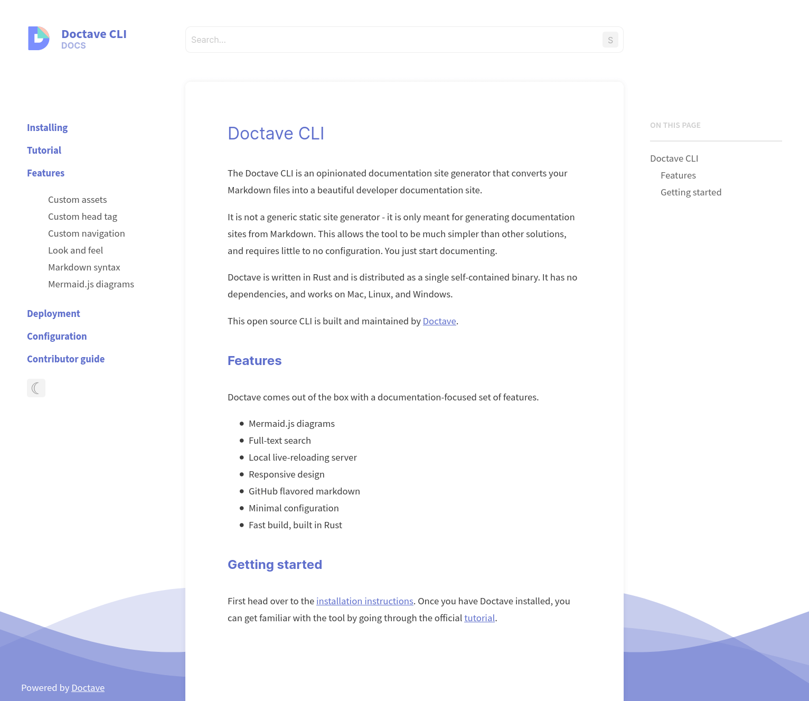
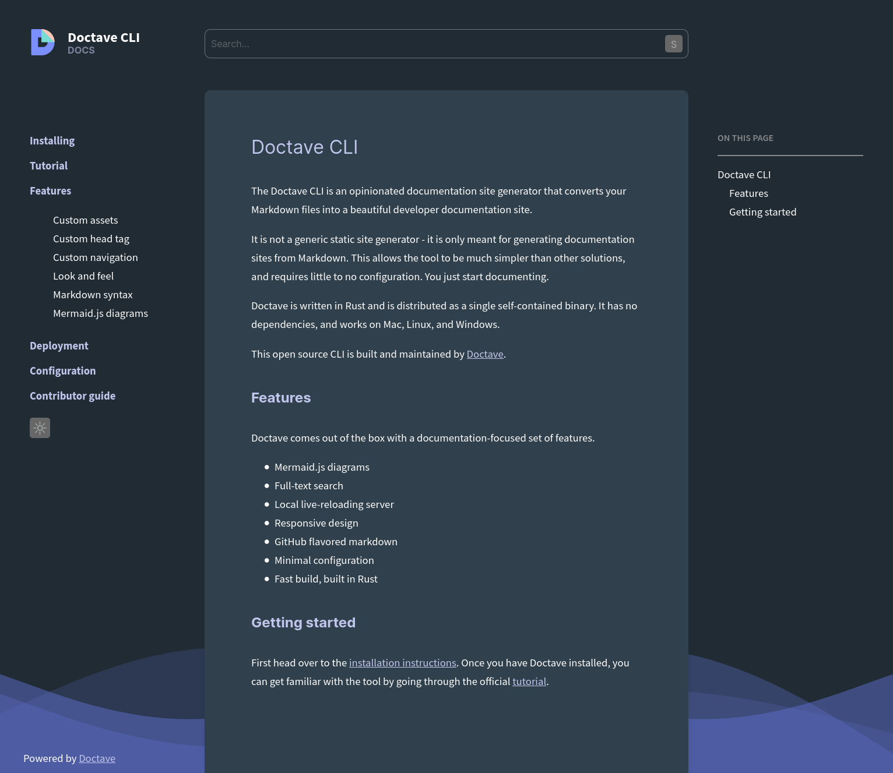
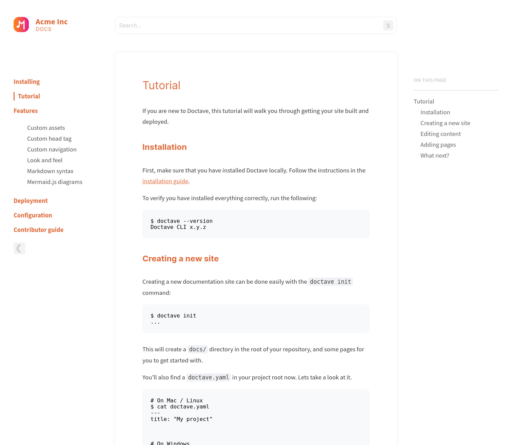
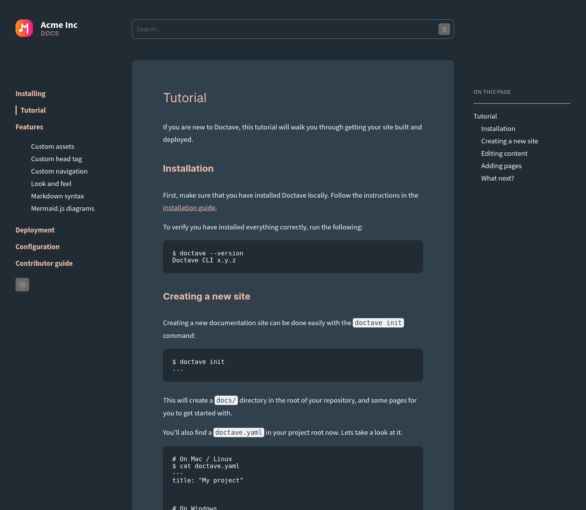

[](https://github.com/Doctave/doctave/actions)
[](https://cli.doctave.com/)


Doctave is an opinionated documentation site generator that converts your Markdown files into
a beautiful documentation site with minimal effort.

Doctave is not a generic static site generator - it is only meant for generating documentation sites
from Markdown. This allows the tool to be much simpler than other solutions, with fewer
configuration steps.

This open source tool is built and maintained by [Doctave.com](https://www.doctave.com).

* [Docs](https://cli.doctave.com) (built with Doctave)
* [Tutorial](https://cli.doctave.com/tutorial)

## Features

Doctave comes with a number of documentation-specific features out of the box. No plugins needed.

- [Mermaid.js](https://mermaid-js.github.io/) diagrams
- Offline full-text search
- Local live-reloading server
- Responsive design
- Dark mode
- GitHub flavored markdown
- Minimal configuration
- Fast build times (Doctave is built with Rust)

## Hosting

Doctave-generated sites can be hosted on any static site hosting provider, such as [GitHub
Pages](https://pages.github.com/). You can also use [Doctave.com](https://www.doctave.com), which is
a specialized Doctave host, for free for public docs.

## Screenshots

You can customize the color scheme and logo to match your own style. Below are two examples: one
with Doctave's own color scheme, and another customized color scheme.

Light                                             | Dark                                                    |
--------------------------------------------------|---------------------------------------------------------|
 |  |
 |  |

## Installation

There are a few installation options for Doctave. If you would like another installation option,
please open an issue for it.

### Precompiled binaries

Doctave provides precompiled binaries for Mac, Linux, and Windows, which you can download from the
[latest release page](https://github.com/Doctave/doctave/releases/latest).

### Homebrew

Doctave maintains its own [homebrew tap](https://github.com/Doctave/homebrew-doctave), and you can
install Doctave via the following command:

```
$ brew install doctave/doctave/doctave
```

This will take a few minutes as Doctave is compiled from scratch for your machine.

### Cargo (Rust package manager)

You can also use the Rust package manager, Cargo, to install Doctave. Currently Doctave is not
listed on crates.io, but you can install it directly from GitHub:

```
$ cargo install --git https://github.com/Doctave/doctave --tag 0.3.1
```

## Getting started

Once you have Doctave installed, you can run the `init` command to create an initial docs site:

```
$ doctave init
```

Then, run the `serve` command to preview your site locally.

```
$ doctave serve

Doctave | Serve
Starting development server...

Server running on http://0.0.0.0:4001/

```
