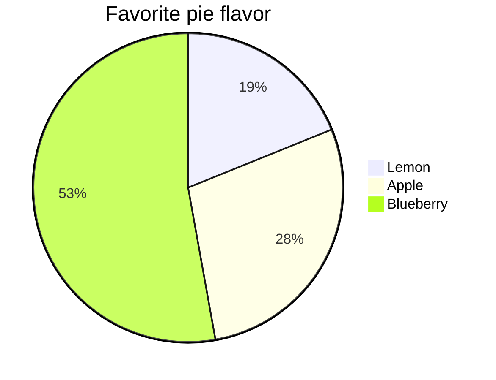
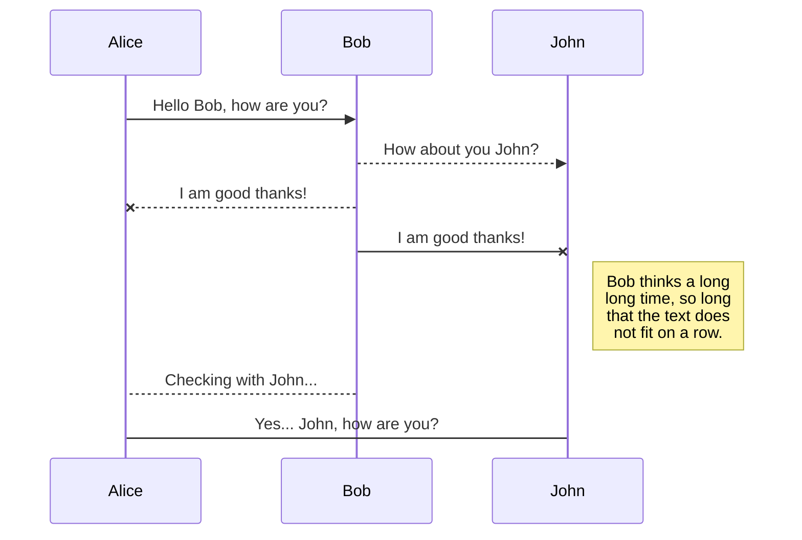
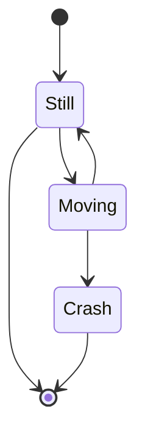

Mermaid.js diagrams
===================

Doctave supports [Mermaid JS](https://mermaid-js.github.io/) diagrams out of the box. All you need
to do is specify the `mermaid` language for your codeblock, and Doctave will render the diagram for
you.

Diagram types supported include

* Pie chards
* Sequence diagrams
* Flowcharts
* Class diagrams
* State diagrams

## Basic example

Specify the mermaid as your code block language:

~~~

~~~

and see your graph rendered as follows:

## Learning Mermaid.js

If you are not familiar with Mermaid JS, we suggest taking a look at their
[tutorials](https://mermaid-js.github.io/mermaid/diagrams-and-syntax-and-examples/n00b-syntaxReference.html)
and playing around with their [live editor](https://mermaid-js.github.io/mermaid-live-editor)

## Further examples

### Pie chart
~~~

~~~

### Sequence diagram

~~~

~~~

[Source](https://mermaid-js.github.io/mermaid/diagrams-and-syntax-and-examples/examples.html#basic-sequence-diagram).

### State diagram

~~~

~~~

[Source](https://mermaid-js.github.io/mermaid/diagrams-and-syntax-and-examples/stateDiagram.html).
